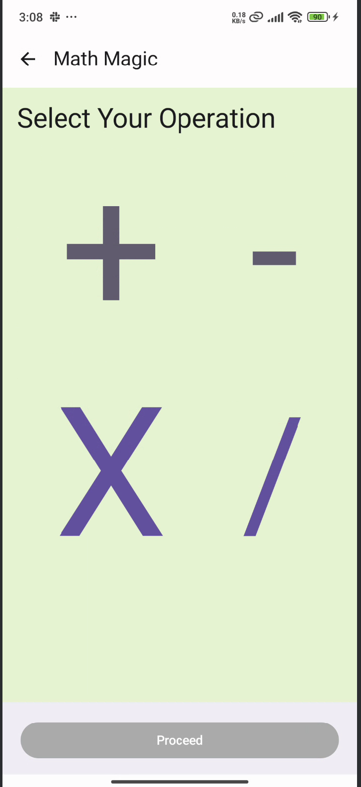
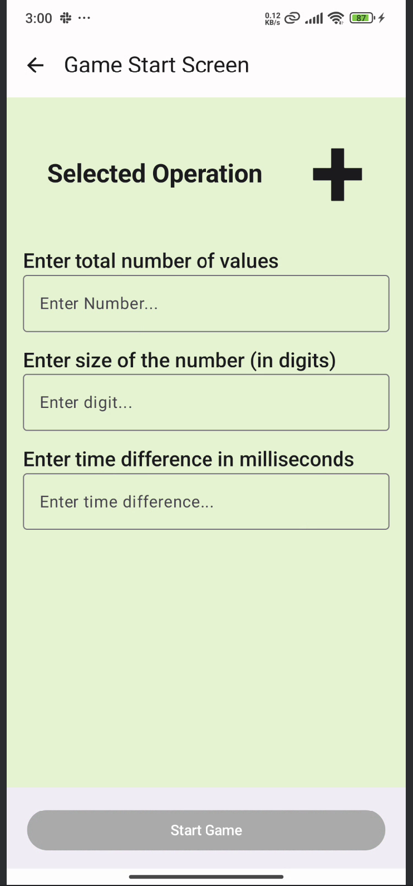
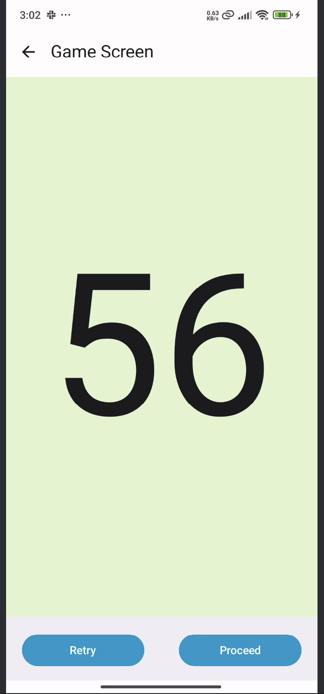
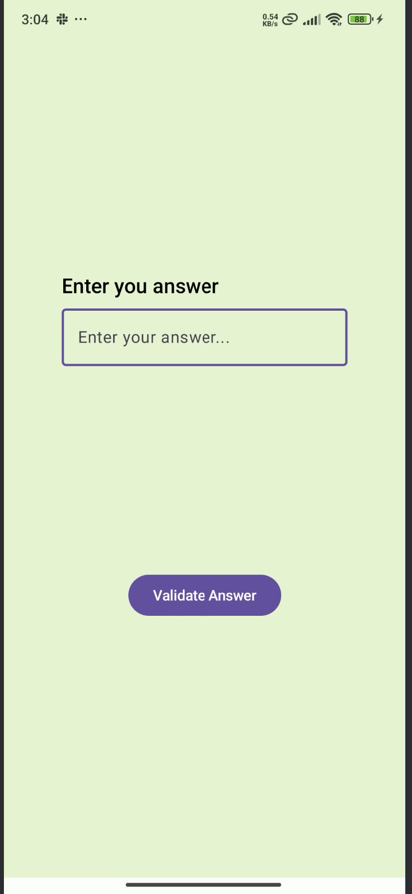
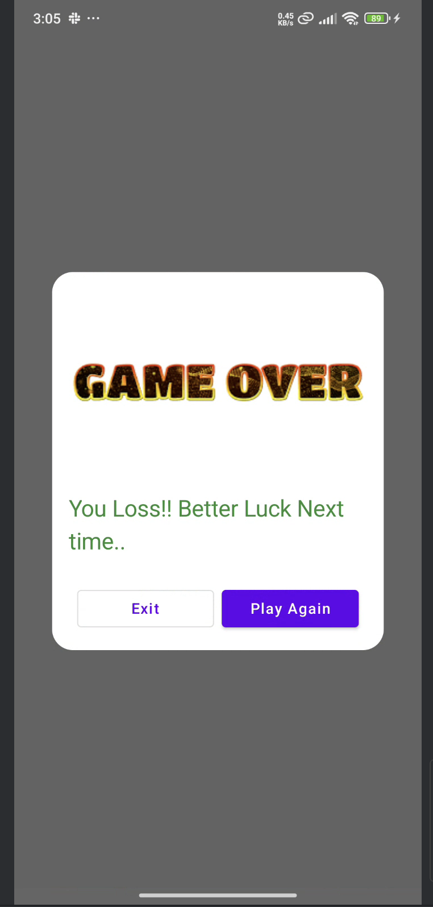

# 📱 MathMagic - Mental Math Practice App

Welcome to **MathMagic** – a lightweight Android application designed to help users practice and improve their mental calculation speed. This app is built using **Kotlin**, **Jetpack Compose**, and follows the **MVVM architecture** pattern.

---

## 🌟 Overview

This is the **first version** of the app, developed as part of my self-learning journey in Android Development. It currently supports practice for the four basic arithmetic operations:

- ➕ **Addition**
- ➖ **Subtraction**
- ✖️ **Multiplication**
- ➗ **Division**

Whether you're a student, competitive exam aspirant, or just looking to stay sharp with numbers – MathMagic is for you!

---

## 🔧 Tech Stack

- 👨‍💻 **Kotlin**
- 🎨 **Jetpack Compose**
- 🏗️ **MVVM Architecture**
- 🛠️ **Android Studio**

---

## 📸 Screenshots

### 🏠 Home Screen

### ➕ Addition Screen

### 🧮 Game Screen

### 🧮 Result / Score Screen

### 🧮 Game Win / Win Screen

### 🧮 Game Loose / Loose Screen

---

## 📦 Download APK

Want to try the app on your device? Download the latest build here:  
👉 [Download APK](https://drive.google.com/file/d/1_Sj7EUN5B4EcF9RWLNMqTSfh2MmiX_ph/view?usp=sharing)

---

## 📂 GitHub Repository

Source code available here:  
👉 [MathMagic GitHub Repo](https://github.com/deepak5204/MathMagic)

---

## 🚀 What’s Next?

Planned features for upcoming versions:

- 🧩 **Level-based progression** – Unlock higher levels as users complete existing ones
- 🏆 **Points & Rewards System** – Earn points for each completed level
- 👤 **User Login & Authentication** – Secure user accounts and progress
- ☁️ **Backend Integration** – Use backend technologies (Node.js, Express, MongoDB, or Firebase) to store user data, scores, and progress

---

## 🤝 Contributing

Feel free to fork the project, suggest improvements, or open pull requests. All contributions are welcome!

---

## 📬 Feedback

If you’ve tried the app or explored the code, I’d love to hear your thoughts.  
Feel free to [connect on LinkedIn](https://www.linkedin.com/in/deepak5204/) or open an issue in the repo.

---

## 🙏 Acknowledgements
- 
- Inspired by the real-world need for improving mental calculation skills
- Special thanks to my teammates whose encouragement and desire to help their children practice basic math motivated this project

---

